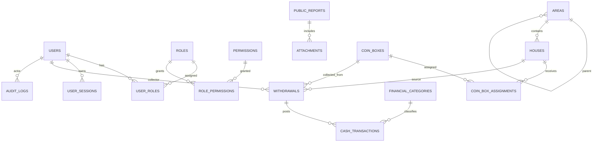

# ERD KOINNU Ranting System

Dokumen ini adalah ERD resmi untuk backend foundation KOINNU Ranting System. Sumber kebenaran teknisnya adalah `prisma/schema.prisma`, sehingga nama tabel, field, enum, relasi, dan constraint di bawah mengikuti schema Prisma production saat ini.

## Ringkasan Domain

- Auth dan RBAC: users, roles, permissions, user roles, role permissions, dan session.
- Operasional KOIN NU: area, rumah donatur, kaleng, assignment kaleng, dan penarikan.
- Keuangan: kategori finansial dan transaksi kas berbasis ledger.
- Publikasi dan audit: laporan publik, attachment, dan audit log.

## Auth dan RBAC

```text
users
-----
id PK
name
email UNIQUE
phone NULL
password_hash
status ENUM(ACTIVE, INACTIVE, SUSPENDED)
last_login_at NULL
created_at
updated_at
deleted_at NULL

roles
-----
id PK
code UNIQUE
name
description NULL
created_at
updated_at

permissions
-----------
id PK
code UNIQUE
name
description NULL
created_at
updated_at

user_roles
----------
id PK
user_id FK -> users.id
role_id FK -> roles.id
created_at
UNIQUE(user_id, role_id)

role_permissions
----------------
id PK
role_id FK -> roles.id
permission_id FK -> permissions.id
created_at
UNIQUE(role_id, permission_id)

user_sessions
-------------
id PK
user_id FK -> users.id
token_hash UNIQUE
expires_at
created_at
```

Relasi:

```text
users 1 -- * user_roles * -- 1 roles
roles 1 -- * role_permissions * -- 1 permissions
users 1 -- * user_sessions
```

Catatan:

- Password disimpan sebagai hash di `password_hash`.
- Response API tidak boleh mengekspos `password_hash` atau `token_hash`.
- Authorization server-side memakai permission `code`, bukan hanya role di UI.

## Area dan Rumah Donatur

```text
areas
-----
id PK
code UNIQUE
name
parent_id FK -> areas.id NULL
created_at
updated_at
deleted_at NULL

houses
------
id PK
area_id FK -> areas.id
name
phone NULL
address
rt_rw
active
joined_at
created_at
updated_at
deleted_at NULL
```

Relasi:

```text
areas 1 -- * houses
areas 1 -- * areas(parent/children)
```

Catatan:

- `houses.deleted_at` dipakai untuk soft delete.
- Status rumah saat ini direpresentasikan dengan boolean `active`.
- Wilayah RT/RW disimpan di `rt_rw`; struktur hirarki wilayah dapat memakai `areas.parent_id`.

## Kaleng dan Assignment

```text
coin_boxes
----------
id PK
box_number UNIQUE
status ENUM(ACTIVE, LOST, DAMAGED, INACTIVE)
distributed_at NULL
created_at
updated_at
deleted_at NULL

coin_box_assignments
--------------------
id PK
coin_box_id FK -> coin_boxes.id
house_id FK -> houses.id
assigned_at
ended_at NULL
status ENUM(ACTIVE, ENDED)
created_at
updated_at
```

Relasi:

```text
coin_boxes 1 -- * coin_box_assignments * -- 1 houses
```

Catatan:

- `coin_boxes` tidak menyimpan `house_id` langsung.
- Assignment aktif ditentukan dari `coin_box_assignments.status = ACTIVE`.
- Saat kaleng dipindahkan, assignment lama diakhiri dengan `status = ENDED` dan `ended_at`.

## Penarikan

```text
withdrawals
-----------
id PK
coin_box_id FK -> coin_boxes.id
house_id FK -> houses.id
collector_id FK -> users.id
amount
status ENUM(PENDING, VALIDATED, REJECTED)
notes NULL
collected_at
validated_at NULL
rejected_at NULL
created_at
updated_at
```

Relasi:

```text
coin_boxes 1 -- * withdrawals
houses 1 -- * withdrawals
users 1 -- * withdrawals(collector)
withdrawals 1 -- * cash_transactions
```

Status flow:

```text
PENDING -> VALIDATED
PENDING -> REJECTED
```

Catatan:

- Transaksi penarikan tidak di-hard-delete.
- Validasi penarikan membuat transaksi kas `INCOME`.
- Actor validasi/reject belum disimpan sebagai kolom khusus; audit actor dicatat di `audit_logs`.

## Keuangan

```text
financial_categories
--------------------
id PK
code UNIQUE
name
type ENUM(INCOME, EXPENSE, ADJUSTMENT)
created_at
updated_at
deleted_at NULL

cash_transactions
-----------------
id PK
category_id FK -> financial_categories.id
withdrawal_id FK -> withdrawals.id NULL
type ENUM(INCOME, EXPENSE, ADJUSTMENT)
amount
description
transaction_at
created_at
updated_at
```

Relasi:

```text
financial_categories 1 -- * cash_transactions
withdrawals 1 -- * cash_transactions
```

Catatan:

- Saldo tidak disimpan sebagai angka final.
- Saldo dihitung dari ledger:

```text
SUM(INCOME) - SUM(EXPENSE) + SUM(ADJUSTMENT)
```

## Laporan Publik dan Attachment

```text
public_reports
--------------
id PK
period UNIQUE
title
summary
status ENUM(DRAFT, PUBLISHED, ARCHIVED)
published_at NULL
created_at
updated_at

attachments
-----------
id PK
public_report_id FK -> public_reports.id NULL
file_name
file_url
mime_type
size_bytes
created_at
```

Relasi:

```text
public_reports 1 -- * attachments
```

Catatan:

- `public_reports.period` adalah identifier periode laporan, misalnya `mei-2026`.
- Attachment saat ini terhubung langsung ke public report.
- Attachment untuk transaksi, bukti pengeluaran, atau dokumentasi program dapat ditambahkan pada fase berikutnya.

## Audit Log

```text
audit_logs
----------
id PK
actor_id FK -> users.id NULL
action
entity_type
entity_id NULL
ip_address NULL
metadata JSON NULL
created_at
```

Relasi:

```text
users 1 -- * audit_logs
```

Minimal action yang sudah dipakai:

```text
auth.login
house.create
house.update
house.delete
withdrawal.create
withdrawal.validate
withdrawal.reject
```

Catatan:

- Audit log tidak dipakai sebagai authorization source.
- Audit log adalah catatan aktivitas untuk tracing dan pemeriksaan perubahan data.

## Mermaid ER Diagram



## Index dan Constraint Penting

```text
users.email UNIQUE
users.status INDEX

roles.code UNIQUE
permissions.code UNIQUE

user_roles(user_id, role_id) UNIQUE
role_permissions(role_id, permission_id) UNIQUE

areas.code UNIQUE
areas.parent_id INDEX

houses.area_id INDEX
houses.rt_rw INDEX
houses.active INDEX

coin_boxes.box_number UNIQUE
coin_boxes.status INDEX

coin_box_assignments.coin_box_id INDEX
coin_box_assignments.house_id INDEX
coin_box_assignments.status INDEX

withdrawals.status INDEX
withdrawals.collected_at INDEX
withdrawals.coin_box_id INDEX
withdrawals.house_id INDEX

financial_categories.code UNIQUE
financial_categories.type INDEX

cash_transactions.type INDEX
cash_transactions.transaction_at INDEX
cash_transactions.category_id INDEX
cash_transactions.withdrawal_id INDEX

public_reports.period UNIQUE
public_reports.status INDEX

attachments.public_report_id INDEX

audit_logs.actor_id INDEX
audit_logs.action INDEX
audit_logs(entity_type, entity_id) INDEX
audit_logs.created_at INDEX
```

## Future Extension

Field dan tabel berikut pernah muncul di draft konseptual atau PRD, tetapi belum menjadi bagian schema production saat ini:

- `coin_boxes.qr_token`
- `houses.code`
- `houses.created_by`
- `withdrawals.validated_by`
- `withdrawals.rejected_by`
- `withdrawals.voided_by`
- `withdrawals.rejection_reason`
- attachment polymorphic ke entity selain public report
- WhatsApp logs
- PDF/export artifact table

Jika fitur tersebut mulai dikerjakan, tambahkan lewat migration Prisma baru dan update dokumen ERD ini setelah schema berubah.
